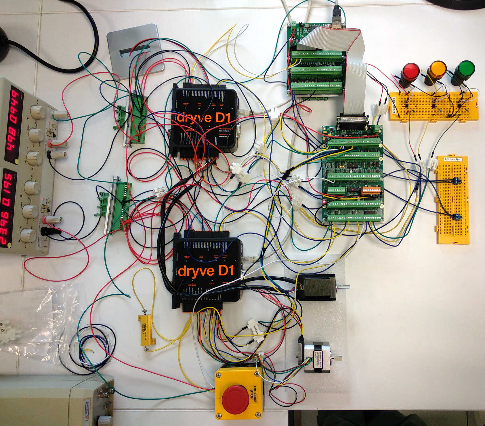

# LinuxCNC Motor Control Testbed

<div align="center">



[](https://creativecommons.org/licenses/by-sa/4.0/)
[](docs/)

</div>

[**Demo Video**](media/prototype_video.webm)

## Overview

A motor control testbed using the open-source [LinuxCNC](https://www.linuxcnc.org) platform integrated with the [Mesa Electronics](https://store.mesanet.com/) 7i96S and 7I77 interface cards and the [igus® dryve D1](https://www.igus.eu/product/D1) motor controllers.

This system was used to to develop and validate the control system for a gantry robot.

## Key Features

- **Real-time Control**: Precise real-time multi-axis motion using LinuxCNC with MESA interface cards and igus® dryve D1 motor controllers.
- **Dual Motor System**: Stepper and brushless motors.
- **Closed Loop Control**: High-precision encoder feedback for accurate positioning.
- **Safety Systems**: Emergency stop and limit switches.
- **Visual Indicators**: Custom LED status system.

## Documentation

The following documentation is provided in this repository:

- **Technical Documentation**: Complete system documentation and setup guide in `docs/`
- **Electrical Installation**: KiCAD electrical schematics in `electrical_installation/`

To build the Sphinx documentation:

```bash
cd docs
pip install -r requirements.txt
make html
```

## Hardware Components

| Component | Model | Quantity | Function |
|-----------|-------|----------|----------|
| **Control Computer** | PC running [LinuxCNC](https://www.linuxcnc.org) | 1 | Real-time motor coordination |
| **Motor Controllers** | [igus® dryve D1](https://www.igus.eu/product/D1) | 2 | Individual motor control |
| **Main Interface** | [MESA 7I96S](https://store.mesanet.com/index.php?route=product/product&product_id=374) | 1 | Ethernet-LinuxCNC bridge. Stepper motor control. Limits detection |
| **I/O Expansion** | [MESA 7I77](https://store.mesanet.com/index.php?route=product/product&product_id=120) | 1 | Brushless motor control. Encoder inputs. Emergency stop detection and LED indicators|
| **Stepper Motor** | [STEPPERONLINE 17HS24-2104-ME1K](https://www.omc-stepperonline.com/nema-17-closed-loop-stepper-motor-65ncm-92oz-in-with-magnetic-encoder-1000ppr-4000cpr-17hs24-2104-me1k) | 1 | Stepper motor with 1000 PPR magnetic encoder |
| **Brushless Motor** | [STEPPERONLINE 42BLS40-24-01](https://www.omc-stepperonline.com/es/24v-4000rpm-0-0625nm-26w-1-8a-42x42x40mm-motor-cc-sin-escobillas-42bls40-24-01) + [CUI Devices AMT102-0512-I5000-S](https://mou.sr/3GkCI6g) | 1 | Brushless motor with 512 PPR optical encoder |
| **Power Supply** | [Aim-TTI EL302RD](https://www.aimtti.com/product-category/dc-power-supplies/aim-el-rseries) | 1 | Dual output (24V/5V) |
| **Emergency Stop** | Push-button with NO/NC contacts | 1 | System safety shutdown |
| **Limit Switches** | Push-button switches | 2 | Position boundary detection |
| **LED Indicators** | 24 V panel mount LEDs | 3 | System state indication |

## System Architecture


## Repository Structure

```txt
linuxcnc-testbed/
├── README.md      # This file
├── media/         # Pictures and videos
├── docs/          # Technical Documentation
├── linuxcnc/      # LinuxCNC configurations
├── schematics/    # Wiring diagrams
├── scripts/       # Example control scripts
├── gcode/         # G-code example
└── documents/     # Hardware datasheets and manuals
```

## License

This project is licensed under the [Creative Commons Attribution-ShareAlike 4.0 International License](https://creativecommons.org/licenses/by-sa/4.0/) (CC BY-SA 4.0), except for files in the `documents/` directory. The Files in the `documents/` directory are datasheets and manuals from different manufacturers and retain their original copyright, these are included for reference only.
