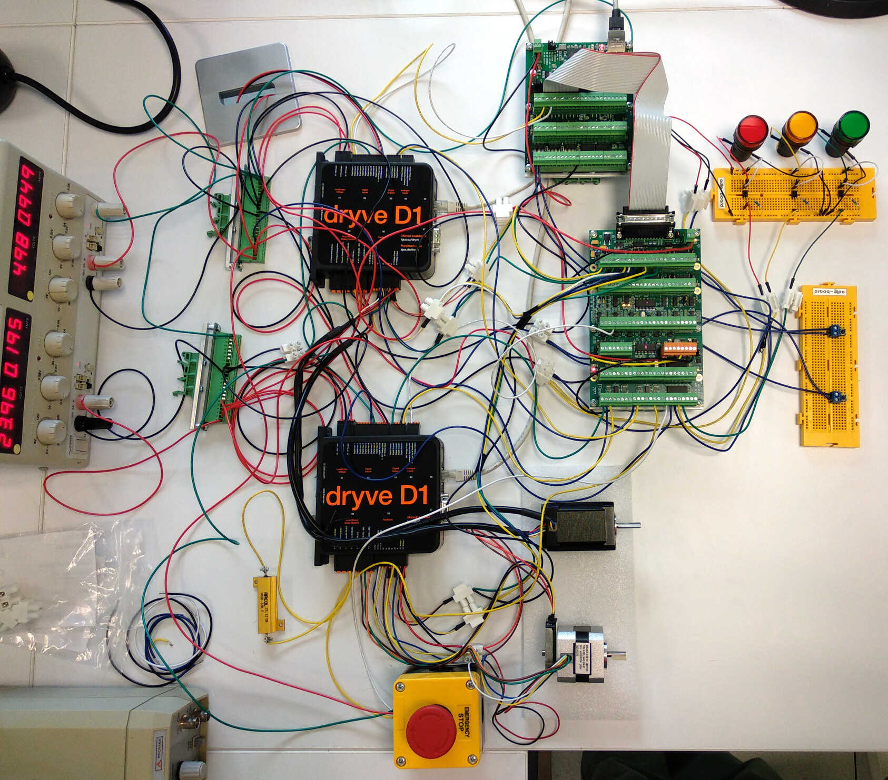

# LinuxCNC Motor Control Testbed

A motor control testbed using the open-source [LinuxCNC](https://www.linuxcnc.org) platform integrated with the [Mesa Electronics](https://store.mesanet.com/) 7i96S and 7I77 interface cards and the [igus® dryve D1](https://www.igus.eu/product/D1) motor controllers.

This system was used to develop and validate the control system for [a large high-precision 3-axis gantry robot system](https://github.com/GTEC-UDC/linuxcnc_gantry_robot).

<div align="center">
  
[](https://creativecommons.org/licenses/by-sa/4.0/)
[](https://www.gnu.org/licenses/fdl-1.3.en.html)
[](docs/)

</div>

<div align="center">
  
</div>

<!-- Video uploaded via drag-and-drop to the GitHub editor -->
<!-- Note: GitHub does not render video files from the repository. See: https://github.com/orgs/community/discussions/19403 -->
<!-- The video is also stored at assets/testbed_video.webm within the repo -->
<video type="video/webm" src="https://github.com/user-attachments/assets/f6507526-396f-41c5-9737-cb749e45726b"><video/>

## Key Features

- **Real-time Control**: Precise real-time multi-axis motion using LinuxCNC with MESA interface cards and igus® dryve D1 motor controllers.
- **Dual Motor System**: Stepper and brushless motors.
- **Closed Loop Control**: High-precision encoder feedback for accurate positioning.
- **Safety Systems**: Emergency stop and limit switches.
- **Visual Indicators**: Custom LED status system.

## Documentation

> [!NOTE]
> Currently the technical documentation is only provided in Spanish. English translation is planned for future releases.

The following documentation is provided in this repository:

- **Technical Documentation**: [Sphinx](https://www.sphinx-doc.org) documentation sources of the system documentation in [docs/](docs/). You can build the HTML version of the documentation with the following commands:

  ```bash
  cd docs
  uv venv && uv sync && source .venv/bin/activate
  make html
  ```

- **Electrical Schematics**: [KiCAD](https://www.kicad.org/) electrical schematics in [schematics/](schematics/).

## Hardware Components

| Component | Model | Quantity | Function |
|-----------|-------|----------|----------|
| **Control Computer** | PC running [LinuxCNC](https://www.linuxcnc.org) | 1 | Real-time motor coordination |
| **Motor Controllers** | [igus® dryve D1](https://www.igus.eu/product/D1) | 2 | Individual motor control |
| **Main Interface** | [MESA 7I96S](https://store.mesanet.com/index.php?route=product/product&product_id=374) | 1 | Ethernet-LinuxCNC bridge. Stepper motor control. Limits detection |
| **I/O Expansion** | [MESA 7I77](https://store.mesanet.com/index.php?route=product/product&product_id=120) | 1 | Brushless motor control. Encoder inputs. Emergency stop detection and LED indicators|
| **Stepper Motor** | [STEPPERONLINE 17HS24-2104-ME1K](https://www.omc-stepperonline.com/nema-17-closed-loop-stepper-motor-65ncm-92oz-in-with-magnetic-encoder-1000ppr-4000cpr-17hs24-2104-me1k) | 1 | Stepper motor with 1000 PPR magnetic encoder |
| **Brushless Motor** | [STEPPERONLINE 42BLS40-24-01](https://www.omc-stepperonline.com/es/24v-4000rpm-0-0625nm-26w-1-8a-42x42x40mm-motor-cc-sin-escobillas-42bls40-24-01) + [CUI Devices AMT102-0512-I5000-S](https://mou.sr/3GkCI6g) | 1 | Brushless motor with 512 PPR optical encoder |
| **Power Supply** | [Aim-TTI EL302RD](https://www.aimtti.com/product-category/dc-power-supplies/aim-el-rseries) | 1 | Dual output (24V/5V) |
| **Emergency Stop** | Push-button with NO/NC contacts | 1 | System safety shutdown |
| **Limit Switches** | Push-button switches | 2 | Position boundary detection |
| **LED Indicators** | 24 V panel mount LEDs | 3 | System state indication |

## System Architecture


## Repository Structure

```txt
linuxcnc-testbed/
├── README.md      # This file
├── assets/        # Pictures and videos
├── docs/          # Technical Documentation
├── linuxcnc/      # LinuxCNC configurations
├── schematics/    # Wiring diagrams
├── scripts/       # Example control scripts
└── gcode/         # G-code example
```

## License

### General License (unless otherwise specified)

<a rel="license" href="http://creativecommons.org/licenses/by-sa/4.0/">

</a>

[LinuxCNC Motor Control Testbed](https://github.com/GTEC-UDC/linuxcnc_testbed) © 2025 by [Tomás Domínguez Bolaño](https://orcid.org/0000-0001-7470-0315), [Valentín Barral Vales](https://orcid.org/0000-0001-8750-7960), [Carlos José Escudero Cascón](https://orcid.org/0000-0002-3877-1332), and [José Antonio García Naya](https://orcid.org/0000-0002-1944-4678) (CITIC Research Center, University of A Coruña, Spain) is licensed under [Creative Commons Attribution-ShareAlike 4.0 International](https://creativecommons.org/licenses/by-sa/4.0/) (CC BY-SA 4.0). To view a copy of this license, see the [LICENSE-CC](LICENSE-CC) file or visit <https://creativecommons.org/licenses/by-sa/4.0/>.

### Documentation License ([docs/](docs/))

Copyright © 2000-2022 LinuxCNC.org\
Copyright © 2025 Tomás Domínguez Bolaño, Valentín Barral Vales, Carlos José Escudero Cascón, and José Antonio García Naya.

Permission is granted to copy, distribute and/or modify this document
under the terms of the GNU Free Documentation License, Version 1.3
or any later version published by the Free Software Foundation;
with no Invariant Sections, no Front-Cover Texts, and no Back-Cover Texts.
A copy of the license is included in the section entitled "GNU Free Documentation License".

## Acknowledgements

This work has been supported by grant PID2022-137099NB-C42 (MADDIE) and by project TED2021-130240B-I00 (IVRY) funded by MCIN/AEI/10.13039/501100011033 and the European Union NextGenerationEU/PRTR.

<div align="center">
  
</div>
